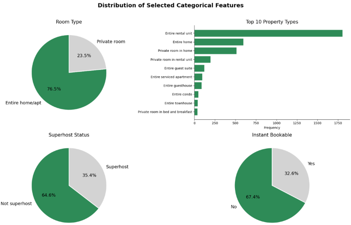
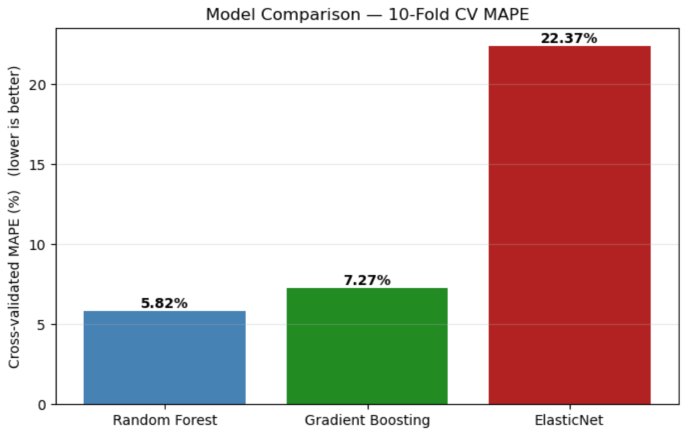
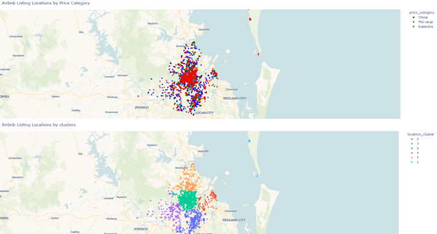
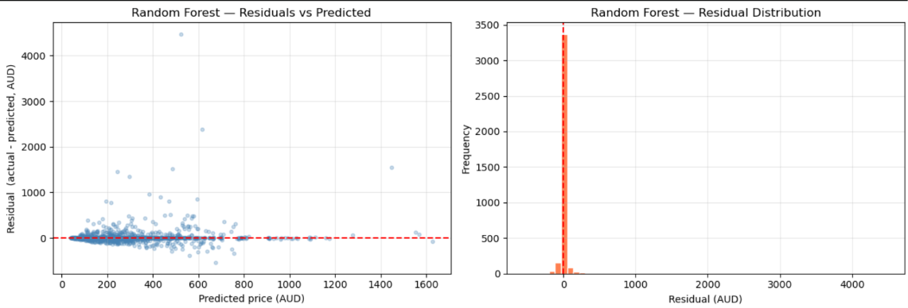

# Predicting Airbnb Listing Prices in Brisbane, Australia

A regression project predicting nightly Airbnb prices (AUD) in Brisbane from listing characteristics — built as a Kaggle-style prediction competition for a university Business Analytics course.

## Summary

| | |
|---|---|
| **Problem** | Predict nightly price from 64 raw fields (property, host, review, booking) |
| **Data** | 3,735 training listings / 1,601 test listings |
| **Approach** | Engineered 64 raw fields → 27 features; compared a regularised linear baseline vs. 4 tree-based ensembles under shared 10-fold CV, scored on MAPE |
| **Result** | Tuned **Random Forest** won — 5.82% CV MAPE, ~6.9% on final Kaggle leaderboard |

  *Raw vs. log-transformed price distribution and skewness diagnostics*

## Tools
`Python` · `pandas` / `NumPy` · `scikit-learn` (ElasticNet, RandomForest, GradientBoosting, HistGradientBoosting, ExtraTrees, VotingRegressor, GridSearchCV) · `matplotlib` / `seaborn` / `Plotly` · `KMeans`

## Key Insights
- **Random Forest (5.82%)** beat ElasticNet (22.37%), Gradient Boosting (7.27%), HistGB (6.92%), Extra Trees (6.86%) — price is driven by non-linear interactions a linear model can't capture.
- **Ensembling didn't help**: tree models produced correlated errors, so a top-3 voting ensemble (6.12%) landed *between* models rather than beating the best one — a useful negative result on when averaging pays off.
- **Bottleneck was data, not modelling**: `implied_price` and `room_type` drove ~74% of Random Forest decisions; every model tested (including XGBoost, LightGBM, CatBoost) converged to a ~6–7% error band, pointing to a feature ceiling rather than an algorithm problem.
- **Business takeaway**: accurate enough to support data-driven pricing — benchmarking listings and flagging under/over-priced ones.

  *CV MAPE across all five models plus the voting ensemble*

  *Interactive map of listing density and price tiers across Brisbane*

  *Residual diagnostics for the final Random Forest model*

## Visuals
"Heatmap.png"
  Correlation heatmap & amenity price-lift chart

"Topfeatures.png"
  Feature-importance plot

## Future Work
Time-based features (seasonality, lead time), non-price-derived signals (review sentiment, description themes), and a "noise floor" estimate from near-identical listings.

📓 Notebook: `Airbnb_PricePrediction_Portfolio.ipynb`
